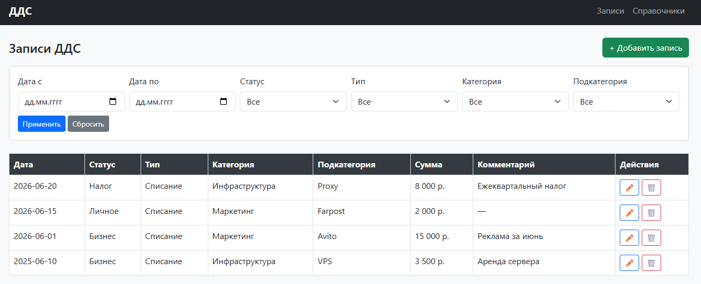
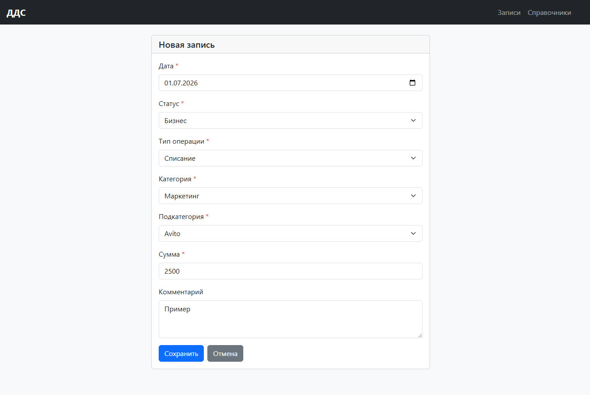
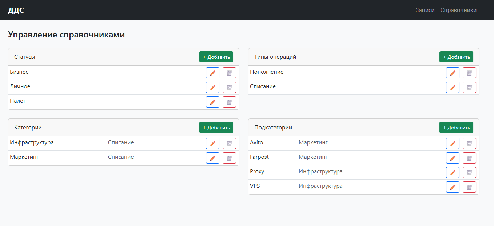
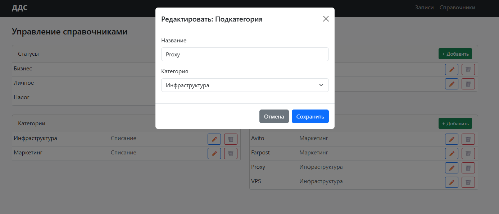

# ДДС – Сервис учёта движения денежных средств

Веб-приложение для учёта поступлений и списаний денежных средств.
Позволяет вести записи по категориям, фильтровать их и управлять справочниками.

## Стек

- **Backend**: Python 3.13, Django 6, Django REST Framework
- **База данных**: PostgreSQL
- **Frontend**: Django Templates, Bootstrap 5, JavaScript (Fetch API)

## Возможности

- Создание, редактирование и удаление записей ДДС
- Фильтрация по дате, статусу, типу, категории и подкатегории
- Динамическая подгрузка категорий и подкатегорий в форме (зависит от выбранного типа)
- Управление справочниками: статусы, типы операций, категории, подкатегории
- Валидация данных на стороне сервера (DRF) и клиента
- REST API

## Скриншоты

**Главная страница – список записей с фильтрами**


**Форма создания/редактирования записи**


**Управление справочниками**


**Редактирование справочника**


## Установка и запуск

### 1. Клонировать репозиторий

```bash
git clone https://github.com/CTTAPTAH/dds-service.git
cd dds-service
```

### 2. Создать и активировать виртуальное окружение

```bash
python -m venv .venv
```

Windows (PowerShell):
```bash
.venv\Scripts\activate
```

Windows (cmd):
```bash
.venv\Scripts\activate.bat
```

Linux/macOS:
```bash
source .venv/bin/activate
```

> Если PowerShell выдаёт ошибку про политику выполнения скриптов, выполните:
> `Set-ExecutionPolicy -ExecutionPolicy RemoteSigned -Scope CurrentUser`

### 3. Установить зависимости

```bash
pip install -r requirements.txt
```

### 4. Создать базу данных PostgreSQL

Создайте пустую базу данных с именем `dds`:

```sql
CREATE DATABASE dds;
```

### 5. Настроить переменные окружения

Скопируйте файлы примера и заполните своими данными:

```bash
copy .env.example .env
```

Откройте `.env` и укажите свой пароль от PostgreSQL и секретный ключ.

Секретный ключ можно сгенерировать командой:

```bash
python -c "from django.core.management.utils import get_random_secret_key; print(get_random_secret_key())"
```

### 6. Применить миграции

```bash
python manage.py migrate
```

### 7. Загрузить начальные данные справочников

```bash
python manage.py loaddata initial_data.json
```

После этого в базе появятся статусы (Бизнес, Личное, Налог), типы операций и примеры категорий с подкатегориями.

### 8. Создать суперпользователя (для доступа к админке)

```bash
python manage.py createsuperuser
```

### 9. Запустить сервер

```bash
python manage.py runserver
```

Приложение доступно по адресу: [http://127.0.0.1:8000](http://127.0.0.1:8000)

Админка: [http://127.0.0.1:8000/admin](http://127.0.0.1:8000/admin)

## API

REST API доступен по адресу `/api/`. Основные эндпоинты:

| Метод | URL | Описание |
|---|---|---|
| GET | `/api/records/` | Список записей ДДС |
| POST | `/api/records/` | Создать запись |
| GET | `/api/records/{id}/` | Получить запись |
| PUT | `/api/records/{id}/` | Обновить запись |
| DELETE | `/api/records/{id}/` | Удалить запись |
| GET | `/api/statuses/` | Список статусов |
| GET | `/api/transaction-types/` | Список типов операций |
| GET | `/api/categories/` | Список категорий |
| GET | `/api/subcategories/` | Список подкатегорий |

### Фильтрация записей

```
GET /api/records/?status=1
GET /api/records/?date_from=2025-01-01&date_to=2025-12-31
GET /api/records/?category=2&subcategory=3
```

### Фильтрация справочников

```
GET /api/categories/?transaction_type=1
GET /api/subcategories/?category=2
```

## Структура проекта

```
dds_project/
├── config/             # Настройки проекта
│   ├── settings.py
│   └── urls.py
├── dds/                # Бэкенд: модели, сериализаторы, API
│   ├── models.py
│   ├── serializers.py
│   ├── views.py
│   ├── urls.py
│   ├── admin.py
│   └── fixtures/
│       └── initial_data.json
├── frontend/           # Шаблоны и статика
│   ├── views.py
│   ├── urls.py
│   ├── templates/
│   └── static/
├── requirements.txt
└── .env                # Не входит в репозиторий
```
